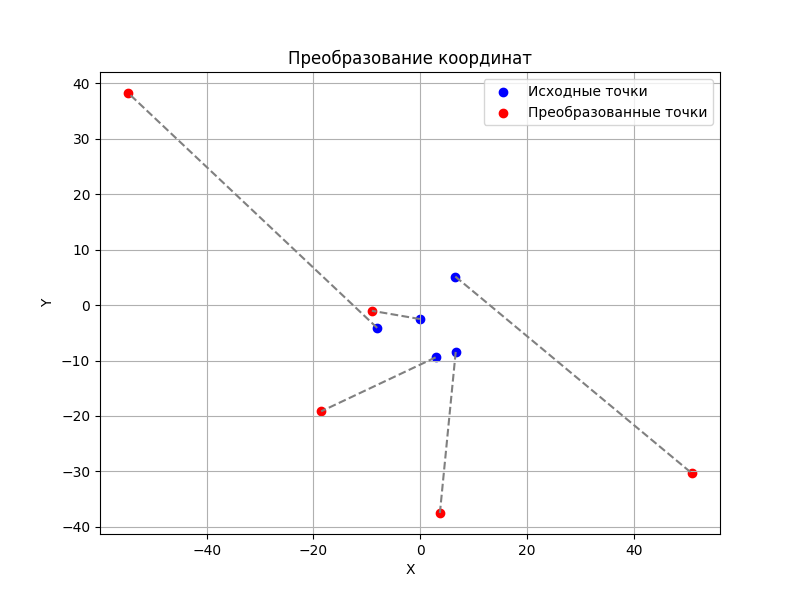

# Отчет о преобразовании координат

## Таблица координат

| Точка | Исходная X | Исходная Y | Преобразованная X' | Преобразованная Y' |
|-------|------------|------------|-------------------|-------------------|
| Точка 1 | 6.58 | 5.14 | 50.88 | -30.32 |
| Точка 2 | -8.06 | -4.12 | -54.70 | 38.23 |
| Точка 3 | 2.89 | -9.43 | -18.55 | -19.16 |
| Точка 4 | -0.05 | -2.52 | -9.05 | -1.03 |
| Точка 5 | 6.65 | -8.45 | 3.69 | -37.49 |

## Параметры преобразования

Матрица преобразования:

$$ \left[\begin{matrix}5.0 & 3.5 & 2.0\\-5.0 & 0.5 & -2.0\\0 & 0 & 1\end{matrix}\right] $$

Система уравнений:

$$
\begin{cases}
x' = 5.0x + 3.5y + 2.0\\
y' = -5.0x + 0.5y + -2.0
\end{cases}
$$
 График преобразования

